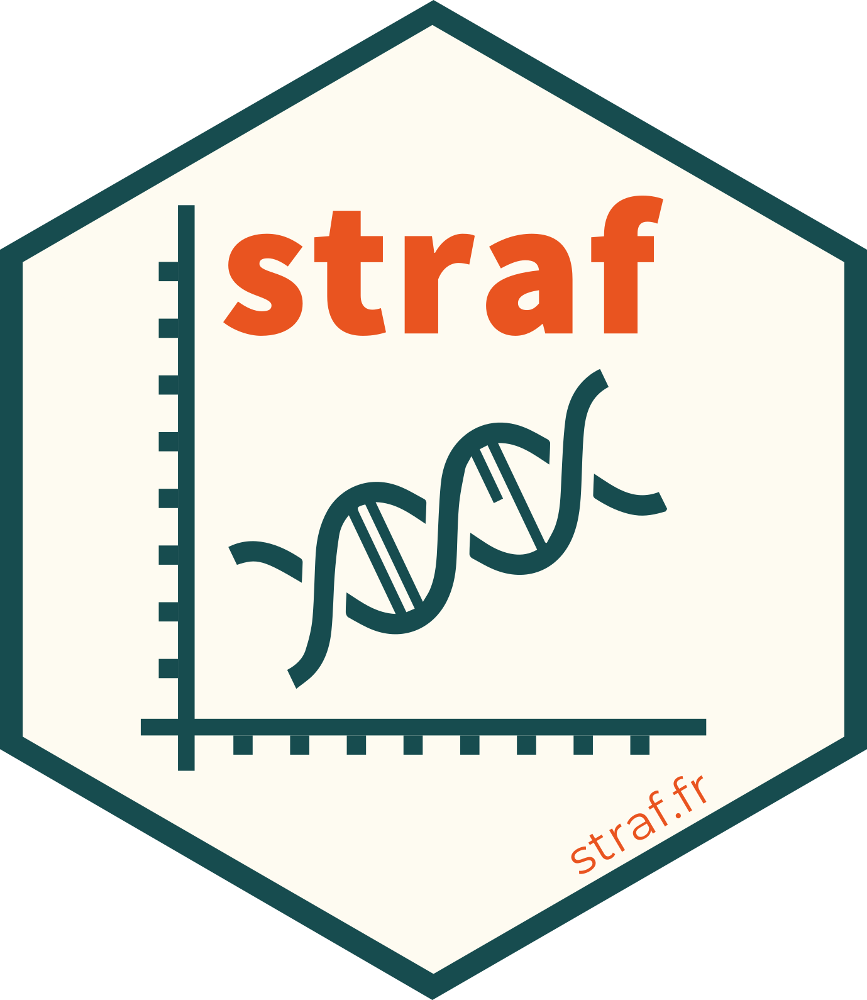

<!-- badges: start -->
[](https://github.com/agouy/straf/actions)
<!-- badges: end -->

# STRAF - STR Analysis for Forensics <a href='http://straf.fr'></a>

### What is STRAF?

STRAF is a web application based on R/Shiny to perform forensics and population genetics analysis of STR data.

[Click here to use the application.](http://straf.fr)

### How to use STRAF?

Please go to the `Documentation` tab within the application to learn how to use the software.

### How to cite STRAF?

If STRAF has been useful to you for your project, please consider citing our paper!

> Gouy, A., & Zieger, M. (2017). STRAF - A convenient online tool for STR data evaluation in forensic genetics. Forensic Science International: Genetics, 30, 148-151.

### Running the application locally

It is possible to run the latest version of the app locally, provided that R is installed on your system. You simply need to run the following lines in R:

```R
library(shiny)
runGitHub("straf", "agouy")
```
