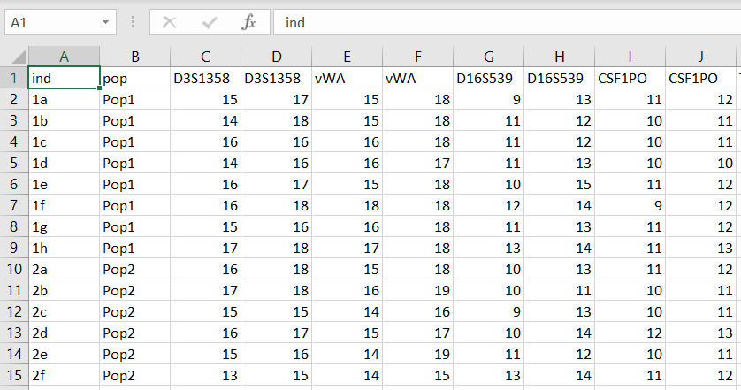
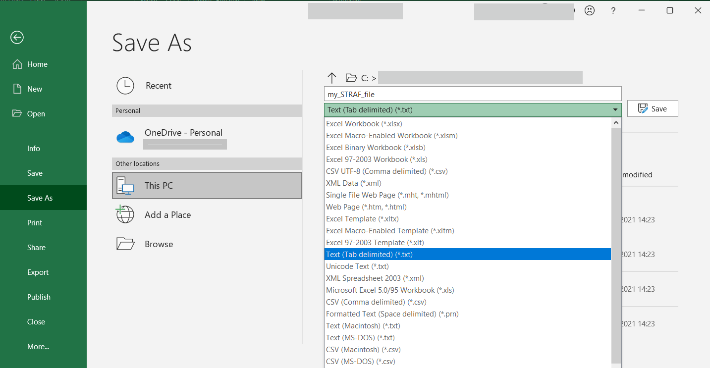
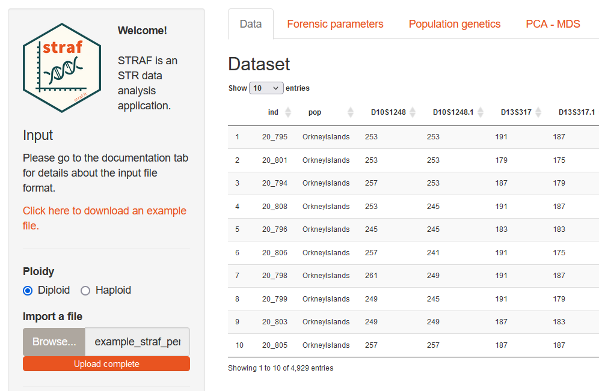
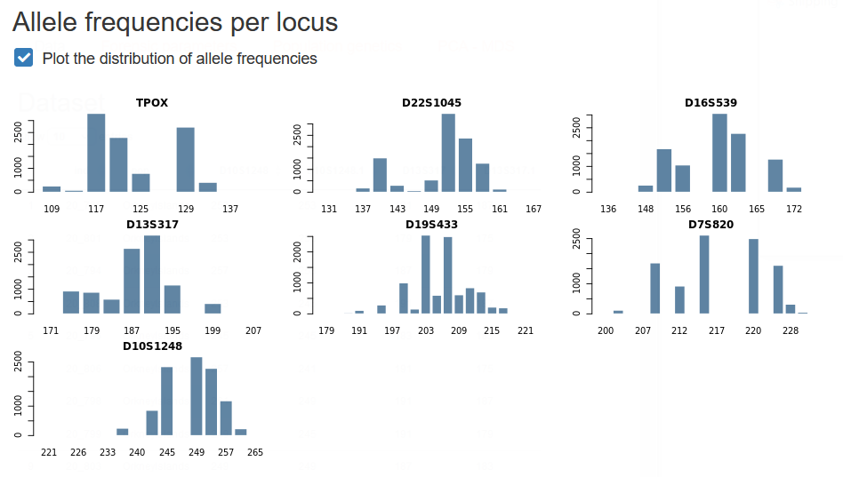
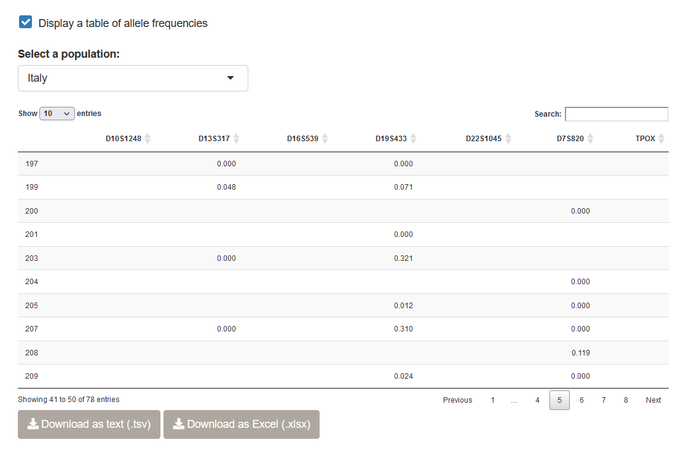

# Importing data

In this chapter, we will explain how to prepare the input file containing 
genotypic data, and how to upload it into STRAF.

## STR data and STRAF input format

STR data consists in various __observations__: the __genotypes__ (number of STR repeats)
of __each individual__, at __each locus__.

In genetics, we potentially observe two values per individual and per locus, if the
markers are diploid, that is two copies are present per sample.

__STRAF's input file__ is a __text__ file containing the genotypes of each sample:

* The first column, named __ind__, needs to contain the sample ID 

* The second column, , named __pop__, contains the population ID (this column must exist even if a single population is studied)

* The next columns correspond to genotypes: for haploid samples, one column per locus must be reported; for diploid data, two columns per locus (with the same name)

* Genotypes must be encoded as numbers (STRAF accepts point alleles)

* Missing data (e.g. null alleles) must be indicated with a “0”.

For diploid data, the table should look like this:

| ind | pop      | Locus1 | Locus1 | Locus2 | Locus2 |
|-----|----------|--------|--------|--------|--------|
| A   | Bern     | 12     | 14     | 17     | 17     |
| B   | Bern     | 14     | 14     | 13     | 15.2   |
| C   | Lausanne | 12     | 16     | 15.2   | 17     |

For haploid data, the table would look like this:

| ind | pop      | Locus1 | Locus2 |
|-----|----------|--------|--------|
| A   | Bern     | 12     | 17     |
| B   | Bern     | 14     | 13     |
| C   | Lausanne | 12     | 15.2   |

## Generating the input data from Excel

It only takes a few steps to generate an input file in a format that is suitable
for use in STRAF. From Excel, for example, we can start from a spreadsheet looking 
like this:

Then, one simply needs to save this table as a tab-delimited text file. This can be
achieved by clicking on `Save As` > `Text (Tab-delimited) (*.txt)`

## Uploading the data to STRAF

Once the input file has been prepared, it is possible to upload it into STRAF. Alternatively,
you can __download an example file__ by clicking on the link in the sidebar.

Then, you need to select the __ploidy__ of your data (for example, _Diploid_ for
autosomal markers, and _Haploid_ for Y-chromosome markers). After that, you can
upload the file by clicking on _Browse_ and selecting the file on your computer.

Once the file is uploaded, a preview will be displayed on the right and all the
analyses will be available. If not, it is likely that an error has occured. If the error
message is not explicit, you can refer to the __Input file checklist__ below that
gathers common issues with the input file.

## Common issues

Even though you've been very careful in the generation of STRAF's input file,
it is possible that you still run into an error after uploading the file to STRAF.
In case STRAF cannot read your input file, we've put together a checklist to identify
common issues with the input file.

:::interpretation
__Input file checklist__

* Check input parameters in the sidebar: do they actually correspond to the input data?
* Check locus names: are they all different for haploid data? Do both columns for a single locus for diploid data have the exact same name?
* Check that all missing data have been encoded with a "0"
* Try to remove any special characters from sample and locus names
* Check for the presence of empty spaces at the end of each line
* Check if alleles are exclusively encoded with numbers
* Check if values are separated by tabs and not spaces
* Check if the first two columns are names "ind" and "pop"
:::

## Having a first look at the data

Below the dataset preview, you will be able to generate a plot of allele frequencies
at each locus.

You can also generate an allele frequency table, which is standard practice when
reporting new population data in a forensics journal. You can either download 
the allele frequencies in a text format (TSV), or as an Excel (XLSX) file. Note
that you have the ability to select a specific population using the drop-down menu
above the table.

