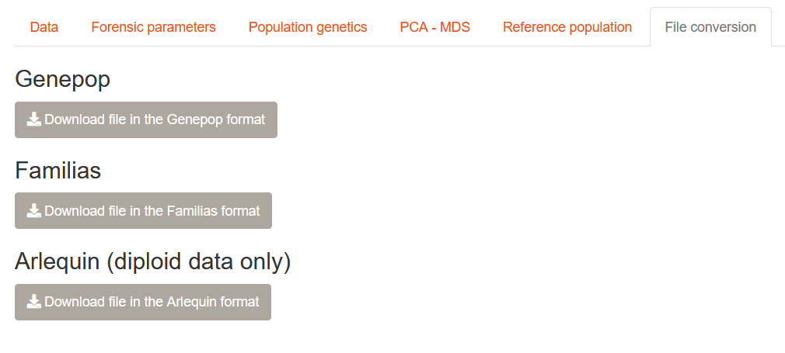

# File conversion

As STRAF is a web application and can be used simultaneously by multiple users,
computing resources are limited. Therefore, the most computationally intensive analyses
are not available in STRAF. In order to ease the path to other software, 
file conversion utilities have been implemented. It is possible to convert
the input file to the __Genepop__, __Arlequin__ and __Familias__ formats. They are
all available in the __File conversion__ tab of the application.

## How to convert a file in STRAF

Once you have imported your file, it is straightforward to conevrt it to another 
format. You can go to the __File conversion__ tab and click on one of the following
buttons to download your genotypes in another format.

## Genepop and Arlequin formats

__Genepop__ and __Arlequin__ softwares implement several population genetics methods, 
including ones that are part of standard forensics practice:
* linkage disequilibrium computation
* Hardy-Weinberg tests

STRAF currently implements these computations, however the ones implemented in 
Genepop are overall more reliable as they can rely on more permutations. They
are overall preferable to the HW and LD tests implemented in STRAF.

## Familias

Here a file containing allele frequencies is created. This file can be used in
Familias to provide allele frequencies reference.
