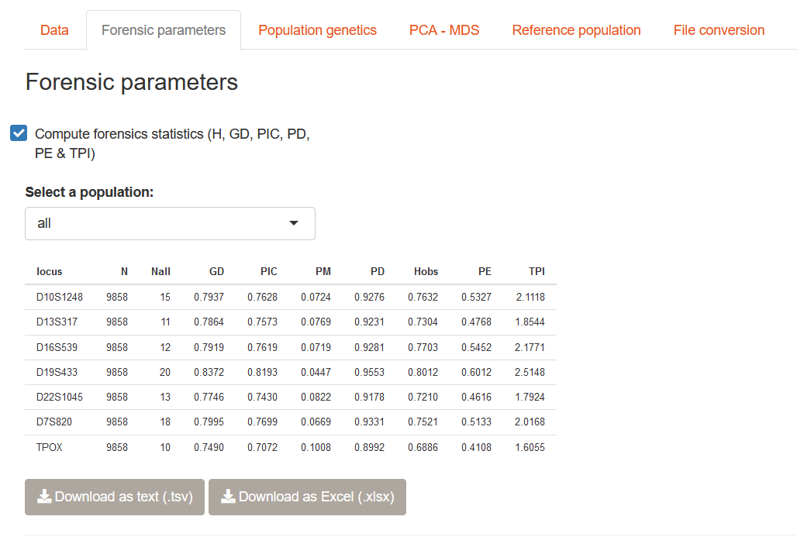
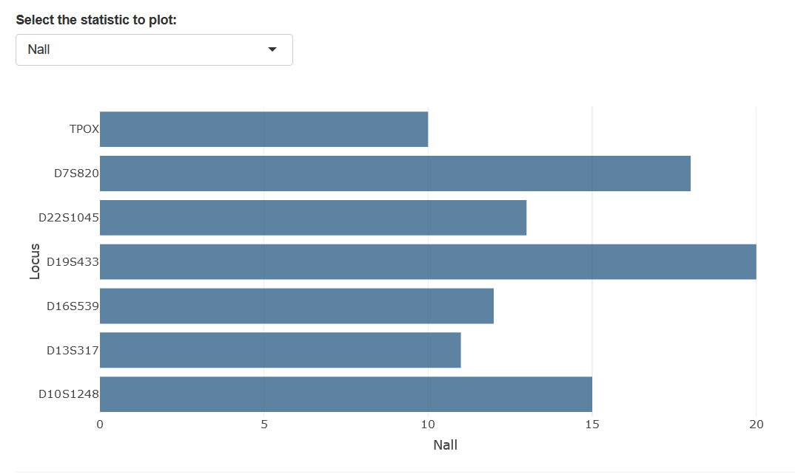

# Forensic parameters

In this chapter, we'll show how to compute forensic parameters using STRAF, and
provide details on how they are computed and should be interpreted.
We'll introduce a few equations, but please do not be afraid! The goal of
this chapter is to translate each of them into plain English.

## How to compute forensic parameters in STRAF

Once your data has bee uploaded, you can go to the __Forensic parameters__ tab
and check the _Compute forensics statistics_ box. The computation will be performed
and a table containing the values per locus will be displayed. The computation is done
per population and overall, a drop-down menu is present to select the population.

Below the forensic parameters table, You can select the metric you would like
to represent using the drop-down menu.

## Details on the forensic parameters

### Random match probability (PM)

The __Random match probability__, or probability of matching (PM), is defined as
the probability of observing a random match between two individuals.

__Formula__

$$
PM = \sum_i (G_i)^2,
$$
where $G_i$ is the frequency of the genotype $i$ at a given locus in the population.

__Interpretation__

Computing $PM$ means calculating, for a given locus, the frequency of each 
genotypes. Then we take the square of each frequency, i.e. we multiply it by itself.
Finally, we sum the values of each genotype.

The intuition behind it is that if we observe a random match in a population when looking
at a single locus, it means that our two samples have the same genotype at that locus.
In terms of probabilities, sampling a specific genotype in the population has a probability 
equal to its frequency. And sampling the same genotype a second time (i.e., observing a match),
is the probability of sampling this genotype multiplied by itself.

As an example, say the genotype "12-14" has a frequency of 5% in the population, the probability of
having a random match between two individuals having the same genotype is 0.05 x 0.05.

To get an overall probability of matching, we sum this over all possible genotypes
in our population.

## Power of Discrimination (PD)

The power of discrimination (PD) is defined as the probability of
discriminating between two unrelated individuals.

__Formula__

$$
PD = 1 - PM
$$

__Interpretation__

PD is simply 1 - PM. Instead of looking at the probability of matching, we are
interested in the probability of "not matching", i.e. the probability of discrimination.

## Gene diversity

__Gene diversity__ ($GD$, sometimes simply $D$), also called __expected heterozygosity__ 
($H_{\mathrm{exp}}$), is computed using the following estimator:

__Formula__

$$
  H_{\mathrm{exp}} = GD = \frac{n}{n - 1} \left( 1 - \sum_{i=1}^{n}(p_i)^2 \right),
$$

where $n$ is the number of gene copies sampled and $p_i$ is the
frequency of the $i^{th}$ allele in the population.

__Interpretation__

It is the probability that an individual will be heterozygous at a given locus.

As an example, a value of $GD$ of 0.6 mean that 60% chance of being
heterozygote at this locus.

It depends directly on the genetic diversity at this locus, which itself depends on 
allele frequencies in your population.

Say we have two alleles in a given population, genetic diversity will be higher
in a population aith allele frequencies 0.5 and 0.5 than in a population where
frequencies are 0.1 and 0.9 (as less heterozygotes can be made with rare
alleles). This rationale can be extended to any number of alleles.

## Polymorphism Information Content (PIC)

__Formula__

The __Polymorphism Information Content__ (PIC) is computed as follow:

$$
PIC = 1 - \sum_{i=1}^{n} p_i^2 - \sum_{i=1}^{n-1} \sum_{j=i+1}^{n} 2p_i^2p_j^2,
$$
where $p_i$ and $p_j$ are allele frequencies.

__Interpretation__

The PIC can be interpreted as:

* the probability that the maternal and paternal alleles of a child are
deducible

* or, the probability of being able to deduce which allele a
parent has transmitted to the child.

## Power of Exclusion (PE)

__Formula__

The __power of exclusion__ ($PE$) is defined as:

$$
PE = h^2\left(1 - 2hH^2\right),
$$

where $h$ is the proportion of heterozygous individuals and $H$ the
proportion of homozygous individuals in the population sample.

__Interpretation__

The power of exclusion depends on the observed proportions of heterozygous and 
homozygous individuals in a population. These proportions, multiplied as in the 
equation above, give the __probability that two persons do not have the same genotype
in the population__.

## Typical Paternity Index (TPI)

Finally, the typical paternity index ($TPI$) reflects the “mean PI for
random non-excluded men“ for a given locus. 

__Formula__

Let $H$ be the frequency of homozygotes, then

$$
TPI = \frac{1}{2H}
$$

__Interpretation__

Unlike the other parameters, the typical paternity index values are not in the 0-1
range and cannot be interpreted as a probability. It is a ratio of 1 divided by
twice the frequency of homozygotes in the population. This is an __odds ratio__,
measuring how many times more likely that a possible father is the actual 
father than a randomly selected man in the population, on average (*typical* case).

