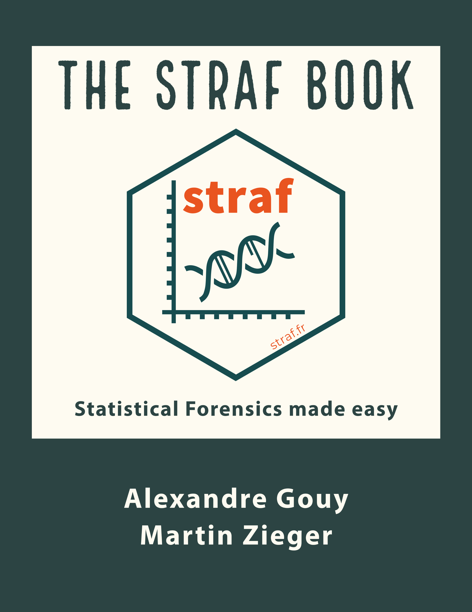

--- 
title: "The STRAF Book"
author: "Alexandre Gouy"
date: "`r Sys.Date()`"
site: bookdown::bookdown_site
documentclass: book
output: bookdown::bs4_book
biblio-style: apalike
link-citations: yes
description: "Test"
---

# Preface {-}

## The story behind STRAF {-}

Forensic genetics and population genetics are inherently linked.
Software and metrics developed in the population genetics field are used in 
routine in forensic genetics practice.

STRAF was born from the encounter of a forensic geneticist and a population geneticist.
In 2017, in Bern, Switzerland, Martin Zieger came to visit a population genetics lab. 
Alexandre was doing his PhD thesis in the lab at that time. A few weeks later, STRAF was born.

Analysing a dataset using scripts I had developed for the analysis of STR / 
microsatellite data. We don't event name our markers the same way, though we 
are doing the exact same thing: genotyping samples, controlling the quality of
our data, computing relevant metrics about our markers, and investigating the
relationship between populations and individuals.

STRAF's story highlights the importance of communication between fields.

## Why read this book? {-}

Coming soon.

## Contents {-}

* Introduction to STRAF

* Forensic parameters

* Population genetics indices

* PCA and MDS

* File conversion
