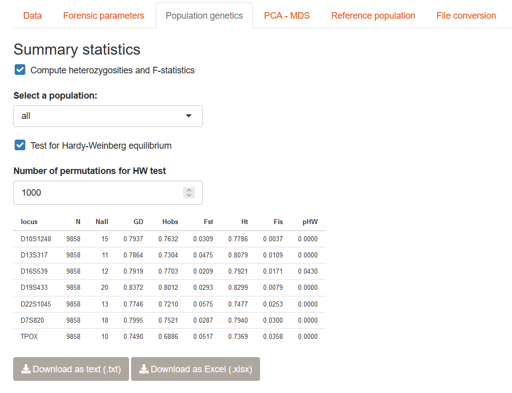
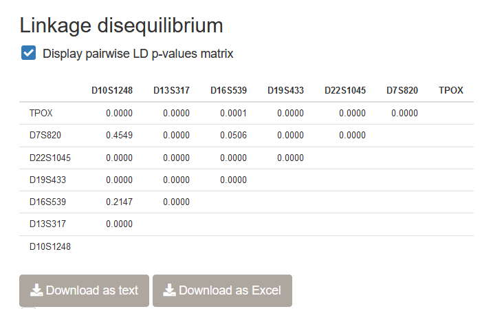

# Population genetics indices

## Population genetics concepts

__Hardy-Weinberg equilibrium__

A population is considered at Hardy-Weinberg equilibrium when

Why is it important to check? If a locus presents a significant deviation from
HWE, it means that a process is influencing the distribution of allele and genotype
frequencies in the population.

* inbreeding

* population structure

* locus is under selection. This is very unlikely that STR loci as they are 
supposed to evolve neutrally. However, they could be found near loci under selection

In forensics, we need to assume HWE as indices computed (for example, a match probability)
would be biased if

* Population structure

Individuals closer from each other are in general more likely to mate with each other.

## How to compute population genetics parameters in STRAF

## Population genetics parameters

* Heterozygosities

* F-statistics: FIS and FST

:::note
__One concept, multiple estimators.__

Several __estimators__ of Fst exist (for example, Weir and Cockerham's, Nei's, 
Hudson's FST). It's like if each population geneticist decided to develop their
own estimator! Why is that? In statistics, what we call an __estimator__
is. It is important to keep in mind that these estimators rely on a specific __model__,
with underlying assumptions. It explains why some estimators are more or less reliable
depending on the case and observed data, and each of them has been developed for 
a different situation.
:::

## What is linkage disequilibrium?

__Coming soon.__

## How to compute LD in STRAF

