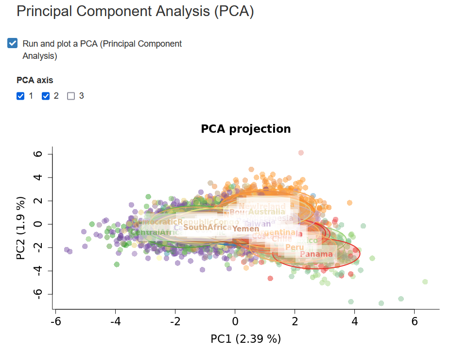
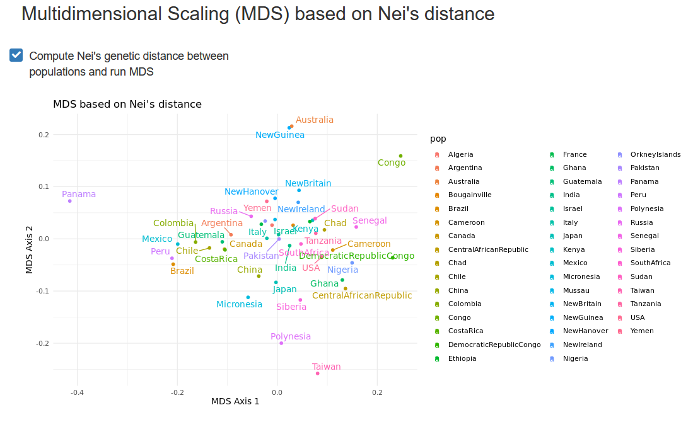

---
output:
  pdf_document: default
  html_document: default
---
# Multivariate statistics

In this chapter, we will describe the two multivariate statistics methods implemented
in STRAF, __Principal Component Analysis__ (**PCA**) and __Multidimensional Scaling__ (**MDS**).

## Principal Component Analysis (PCA)

PCA is a method of __dimensionality reduction__. What is does it that it tries to
__capture most of the variation__ present in the data and __project__ it onto a 
small number of new axes called __principal components__ (PCs).

This is a useful method to capture variation from a large number of variables and
allows to discover hidden patterns by increasing interpretability.

In our case, if we consider that __each allele at each locus__ is a variable, and that
our individual observations are the presence / absence of each allele for each sample,
we end up with a highly dimensional dataset (we have as many variables as we have
alleles!). It gets even worse if you analyse genome sequences, where you can have millions
of variables in your dataset. This is definitely not an interpretable dataset if you
are not able to easily extract relevant information.

PCA allows to bring most of the variation existing between our samples onto a few
axes capturing most of the variation (PCs).

In STRAF, you can perform a PCA by going into the __PCA - MDS__ tab and checking
the following _Run and plot a PCA_ checkbox.

It will trigger the PCA computation and return a graph. You are also able to 
download to coordinates on different PCs (also called eigenvectors).

::: {.interpretation data-latex=""}
__Interpreting PCA results__

PCA has become a popular tool in population genetics, as the relationships between
individuals on the PCA projection tends to reflect their genetic __relatedness__. The
closer individuals are on the PCA projection, the more genetically related they tend to be.

It can also be used as a __quality control__ tool. For example, if a sample is very far
from all the others, including the ones that are part of the same population,
it is possible that there is an issue with the data. One would need to inspect
the raw data and check if any strange pattern can be found.

It is important to be aware of the influence of non demographic processes on
the PCA projection. For example, __imbalanced sample sizes__ between populations
can drive some patterns. When populations are sampled unevenly, the projection will
be __distorted__ and distances observed on the projection can be driven by these
differences and not by their evolutionary history.

Hence, as multiple processes influence the results, PCA should remain an 
__exploratory approach__ and further analyses should be conducted before drawing
any major conclusions on the relationships between populations and individuals.
:::

## Multidimensional Scaling (MDS)

An __MDS__ is conceptually similar to a PCA. One of the main differences is 
that it takes as input data in a different format. As PCA uses raw genotypes and
can accommodate data at the individual level, __pairwise distances__ between data 
points are used for an MDS. 

In forensics practice, it is typically used to compare __populations__ and not 
__individuals__, even though it would be theoretically possible.

As __pairwise distances between populations__ are used, and MDS can be based on
any genetic distance: one could for example compute pairwise __FSTs__, 
__Nei's genetic distance__, or any other metric.

Based on these distances, the MDS will __project__ the populations onto a 
__lower-dimensional space__. This projection facilitates the interpretation of 
relationships between populations.

::: {.interpretation data-latex=""}
__Interpreting MDS results__

Just like with a PCA, populations the __closer__ populations are on the MDS projection,
the more __genetically related__ the tend to be, based on the markers that have been 
used to compute their pairwise genetic distances.

Again, like for the PCA, the MDS should remain an 
__exploratory approach__ and further analyses should be conducted before drawing
any major conclusions on the relationships between populations and individuals.
:::
