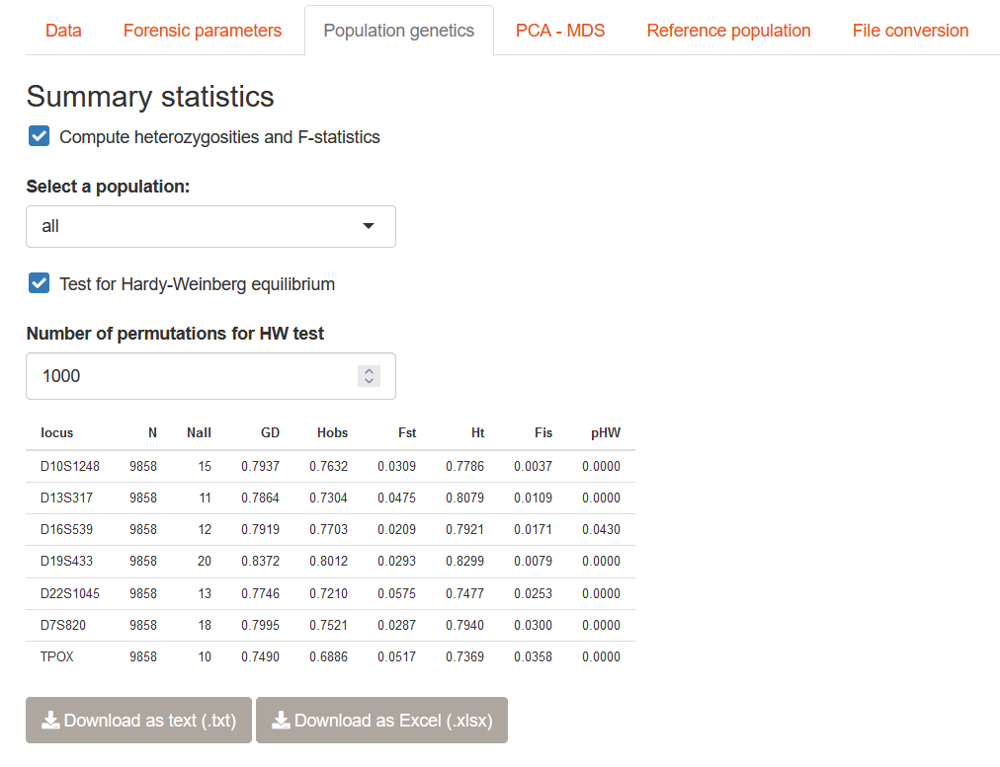
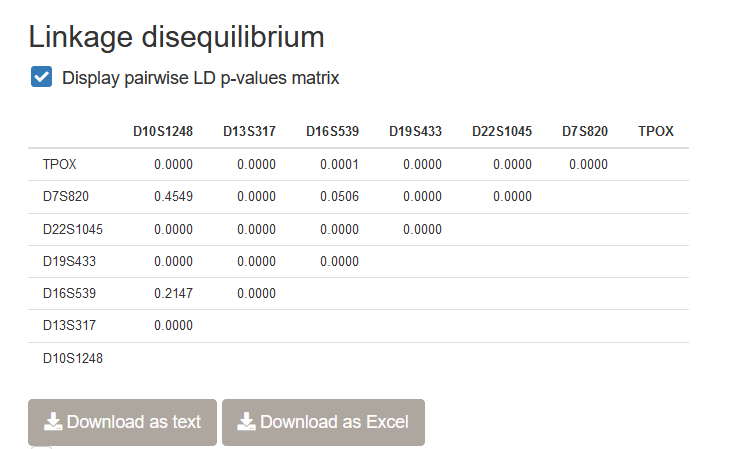

# Population genetics indices

In this chapter, we will see how to compute some population genetics indices in STRAF.

## Computing population genetics parameters in STRAF

Once you have uploaded your genotypes in STRAF, you can go to the __Population genetics__
tab to compute relevant population genetics indices. It is also possible to perform
a Hardy-Weinberg equilibrium test by checking the relevant box.

## Details on population genetics indices

### Hardy-Weinberg equilibrium

A population is considered at Hardy-Weinberg equilibrium (HWE) when the observed
genotypic frequencies are in agreement with the expectations in an "ideal" population,
which assumes for example random mating in the population. 
This is important as the assumptions of the Hardy-Weinberg model
allow to derive quantities such as forensic parameters and population genetic indices.
Therefore, if some assumptions of the model are violated, conclusions drawn from
metrics computed assuming HWE could be challenged.

If a locus presents a significant deviation from HWE, it means that a process
is influencing the distribution of allele and genotype frequencies in the population.
It could for example be due to __inbreeding__, __hidden population structure__,
or __natural selection__.

STRAF reports the __p-value__ of a test for HWE. A low p-value indicates a significant
deviation from HWE.

### Heterozygosities

In STRAF, several measures of __heterozygosity__ are computed. They capture
different aspects of genetic diversity.

* The __expected heterozygosity__ (or __Gene diversity__, $H_{exp}$ or $GD$) has been defined in the previous chapter.

* The __observed heterozygosity__ ($H_{obs}$) is the proportion of heterozygous genotypes at this locus in the population.

* The __total heterozygosity__ ($H_T$) is the heterozygosity expected if all the
individuals in all the subpopulations were behaving as a population at HWE.

### F-statistics

STRAF reports two __F-statistics__. 

* The $F_{\textrm{IS}}$ is a measure of genetic relatedness within a population.
It is sometimes called the __inbreeding coefficient__. High values indicate
a high degree of inbreeding.

* The $F_{\textrm{ST}}$ is a measure of genetic differentiation between populations.
It takes values between 0 (no differentiation) and 1 (full differentiation).

:::note
__One concept, multiple estimators.__

Several __estimators__ of $F_{\textrm{ST}}$ exist (for example, Weir and Cockerham's, Nei's, 
Hudson's $F_{\textrm{ST}}$). It's like if each population geneticist had decided 
to develop their own estimator! 

Why is that? In statistics, what we call an __estimator__ a metric aiming at estimating
a given quantity based on __observed data__. It is important to keep in mind that 
these estimators rely on a specific __model__, with underlying assumptions. 
It explains why some estimators are more or less reliable depending on the case 
and observed data, and each of them has been developed for a different situation.
In the case of $F_{\textrm{ST}}$ for example, different estimators assume 
different demographic models.
:::

## Linkage disequilibrium (LD)

### What is linkage disequilibrium?

Linkage disequilibrium is an important quantity to be measured in genetics. 
It is defined as the __nonindependence of genotypes at distinct loci__.
It means that it is more likely to observe the co-occurence of some genotypes
at different loci.

Most of the times, this is explained by the physical proximity between loci. If
two loci are next to each other on the genome, recombination events between them
will be rare and genotypes won't be suffled. Genotypes at these loci will be correlated
and linkage disequilibrium will be high. On the other hand, two loci found on two different
chromosomes are not expected to show any LD signals as genotypes will be systematically 
shuffled at each generation.

### How to compute LD in STRAF?

It is possible to test for the presence of LD in the dataset you uploaded using
STRAF. After checking the _Display pairwise LD p-values matrix_, LD tests between
each pair of loci will be performed and p-values will be reported.

__Important note__: Other population genetics software, 
__Genepop__ and __Arlequin__, implement more reliable
versions of the LD test that should be preferred. They are currently not implemented
in STRAF because of performance limitations. If you need to perform such a test, the
__File conversion__ utilities (cf. Chapter 6) should facilitate the workflow.
