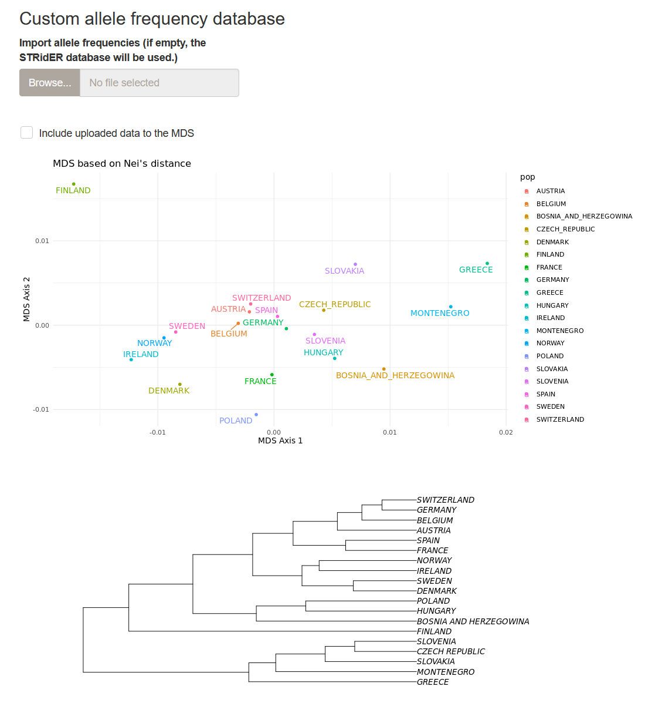
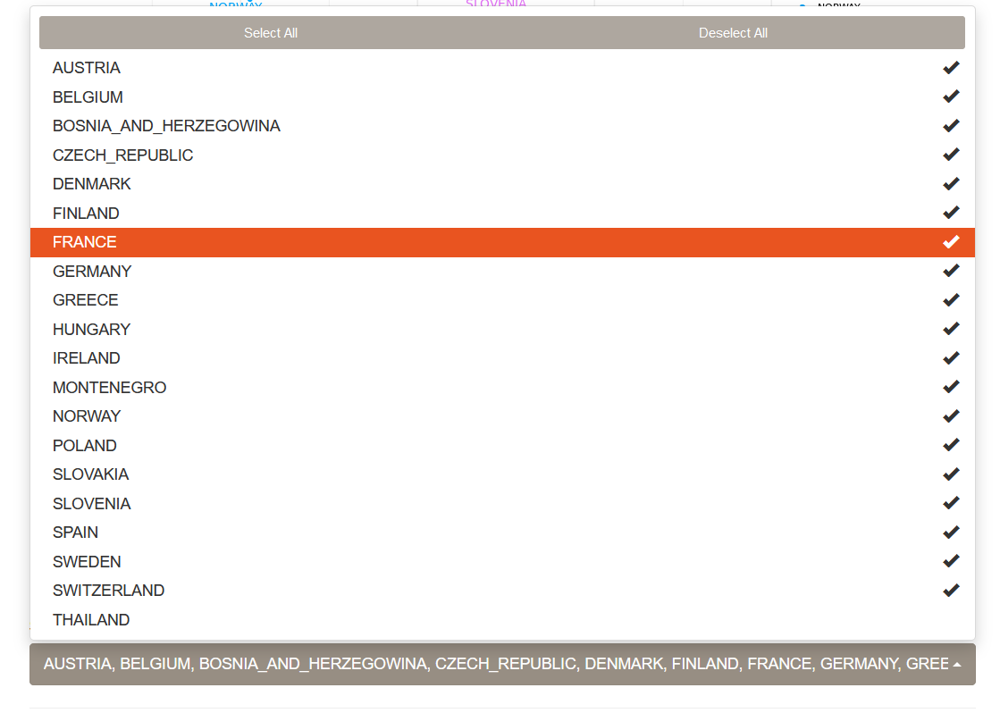
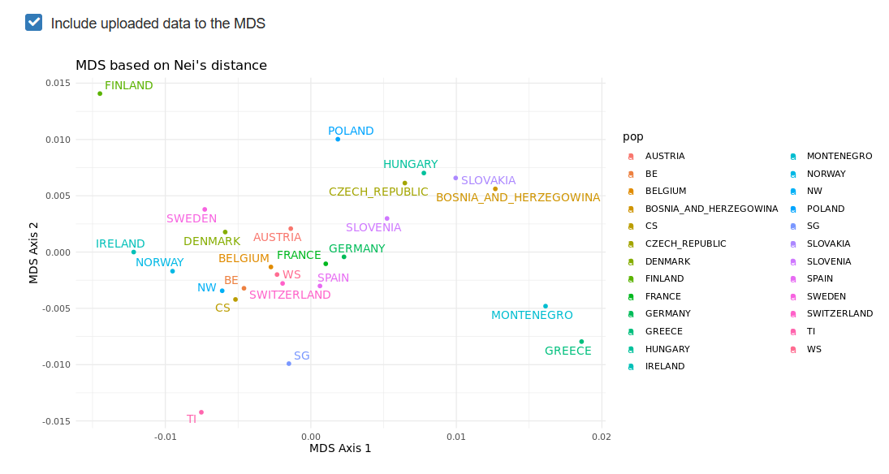
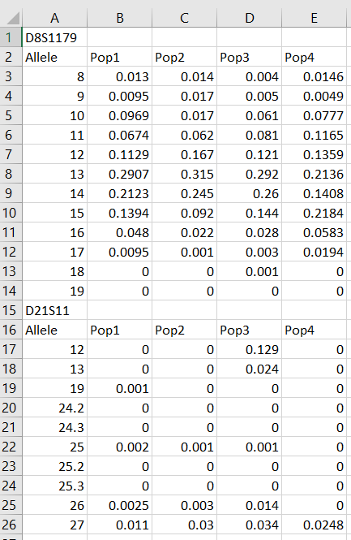
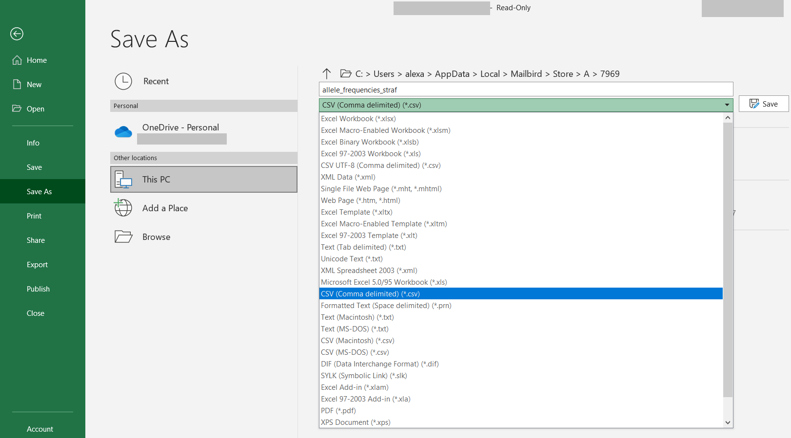

# Reference populations analysis

In this chapter, we will see how to compare the uploaded populations to 
reference populations (based on allele frequencies).

## MDS on reference frequencies

STRAF implements an MDS computation based on allele frequency data. By default, 
allele frequencies from the STRiDER database are used (loci with less than 10 
populations have been excluded). If you are not familiar with the MDS method and
interpretation, you can find details in __Chapter 4__.

You can see the output of the MDS in the __Reference population__ tab. It includes the
MDS projection in two dimensions for 19 European populations, as well as the population
tree.

The drop-down menu below the plots allows one to select or unselect populations
to be used in the MDS analysis.

Provided that some loci are in common between the reference allele frequencies and
the genotypes you uploaded, it is possible to add your own populations to the existing MDS
by checking the _Include uploaded data to the MDS_ box.

You will then see your populations added to the MDS plots.

## Preparing a custom allele frequency database

If you want to use other reference databases than STRIDER, for example if you're working with 
non-European samples or with different loci, it is possible to upload a custom
allele frequency database in STRAF.

The data must be formatted as follows:

| D1S1656 |            |         |        |
|--------|-------------|---------|--------|
| Allele | Switzerland | Germany | France |
| 9      | 0.12        | 0.09    | 0      |
| 10     | 0.40        | 0.35    | 0.28   |
| 10.2   | 0.31        | 0.41    | 0.5    |
| 11     | 0.17        | 0.15    | 0.22   |
| __D2S1338__ |        |         |        |
| Allele | Switzerland | Germany | France |
| 19     | 0.40        | 0.38    | 0.42   |
| 20     | 0.42        | 0.26    | 0.28   |
| 21     | 0.31        | 0.36    | 0.3    |

Starting from an Excel file for example, we can start with a spreadsheet that looks 
like this:

Then, one simply needs to save this table as a CSV (Comma-Separated Values) file. This can be
achieved by clicking on `Save As` > `CSV (Comma-delimited) (*.csv)`

Then, you can upload your data and use it as described for the STRIDER database.
